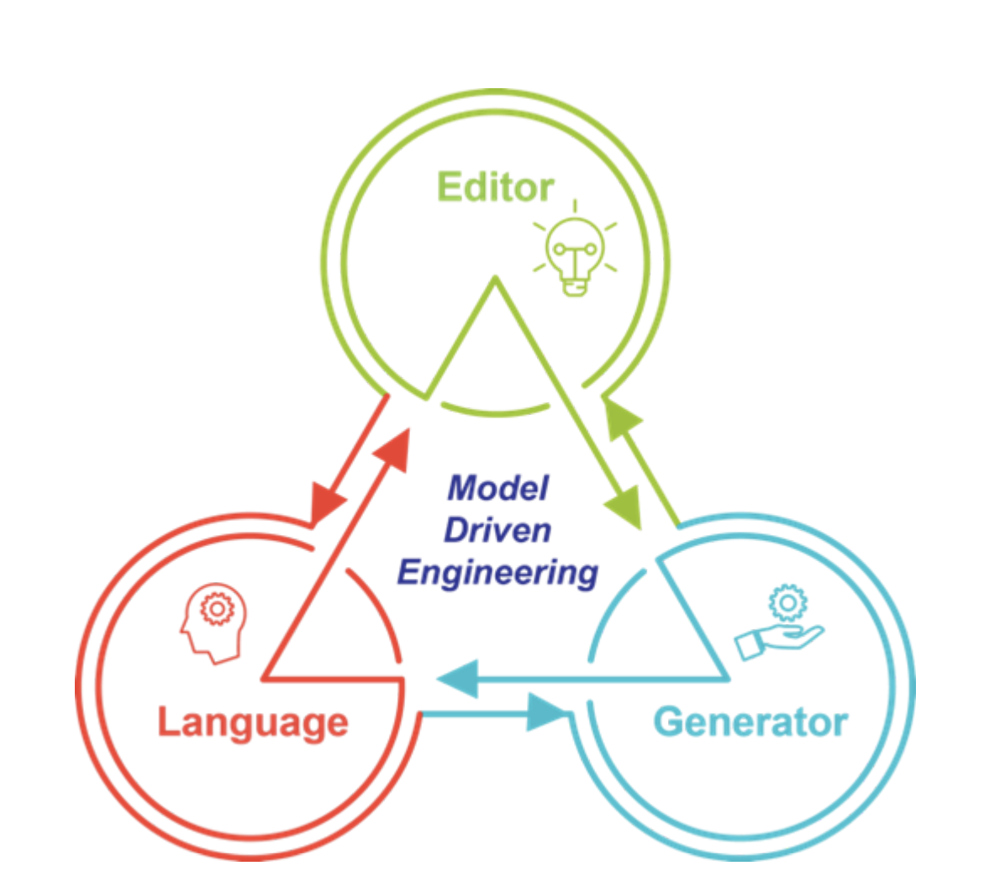
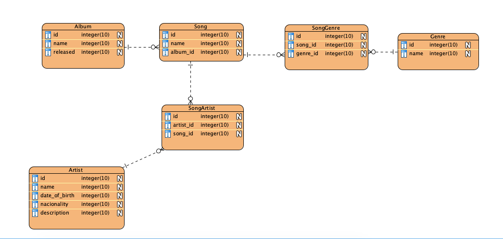

# <center>Manual Técnico</center>

# <center></center>

##### Curso:

Engenharia Informática - Ramo de Engenharia de Software

##### Unidade Curricular:

Desenvolvimento Baseado em Modelos

##### Docentes:

- Prof. Joaquim Filipe
- Eng. Filipe Mariano

##### Estudantes:

- Patrick Forsthofer - 190200007
- Tiago Neto - 160221086
- Tomás Santos - 160221032

---

## 1. A arquitetura do sistema.

O sistema está dividido em 3 pacotes:

```
packages
  core
  editor
  frontend
```

`packages/core` é um projeto em Node.JS, Express e SQLite3, onde está implementado o gerador de código e a API REST.

Arquitetura detalhada:

```
    packages/core
      src
        app
          controllers
            GeneratorController.js
          models
          services
            ControllerService.js
            DatabaseService.js
            HomeService.js
            ModelService.js
            RouterService.js
            ViewService.js
          templates
            controller.js
            model.js
            router.js
            view.js
        config
          database.js
          path.js
        database
          index.js
        libraries
          Model.js
        routes
          app
            index.js
          auth
            index.js
          index.js
        schemas
        app.js
        server.js
```

- <b>GeneratorController.js:</b> Código responsável por invocar todos os services.
- <b>ControllerService.js:</b> Gera o código para um controller.
- <b>DatabaseService.js:</b> Cria as tabelas, colunas e relações na base de dados.
- <b>HomeService.js:</b> Adiciona no arquivo `front/src/pages/Home/models.js` o nome do model.
- <b>RouterService.js:</b> Gera o código para o roteamento do express.
- <b>controller.js:</b> Template do controller.
- <b>model.js:</b> Template do model.
- <b>router.js:</b> Template do roteamento express.
- <b>view.js:</b> Template da página do `front`
- <b>path.js</b> Código relacionado com os diretórios dos componentes gerados.
- <b>ViewService.js:</b> Gera o código para a página do frontend.
- <b>app.js:</b> Inicializa o database e as rotas do express.
- <b>server.js:</b> Inicia o servidor express.

`packages/editor` é um projeto em React.JS, onde está implementado o editor de código.

Arquitetura detalhada:

```
    packages/editor
      src
        data
          album.json
          artist.json
          genre.json
          song.json
        services
          api.js
        App.js
```

- <b>data:</b> O diretório onde ficam os JSON Schemas.
- <b>api.js:</b> Código responsável por configurar o endpoint para a conexâo com o GeneratorController do `core`
- <b>App.js:</b> O editor de código.

`packages/front` é outro projeto em React.JS, onde está implementado o frontoffice e backoffice.

Arquitetura detalhada:

```
    packages/front
      src
        components
          layout
            index.js
            Links.js
          Checkbox.js
        pages
          Home
            index.js
            models.js
        routes
          index.js
          Route.js
        services
          api.js
```

- <b>layout:</b> O diretório relacionado com o header das páginas.
- <b>Checkbox.js:</b> A interface para relacionar models quando existe relações M-M.
- <b>Home:</b> Código relacionado com o frontoffice.
- <b>routes:</b> Código referente ao roteamento de páginas.
- <b>api.js:</b> Código responsável por configurar o endpoint para a conexâo com os endpoints do `core`

## 2. Especificação dos diversos componentes do projeto (geradores) e integração dos mesmos.

`[POST] /generators` O GeneratorController é o principal controller do gerador, é através dele que todos os serviços dos componentes são invocados.

```
class GeneratorController {
  async store(req, res) {
    const { title: name, properties, required, references } = req.body;

    const args = {
      name,
      model: name.toLowerCase(),
      properties,
      required,
      references,
    };

    const schemaPath = resolve('src', 'schemas', `${name}.json`);
    if (fs.existsSync(schemaPath)) {
      return res.status(400).json({ error: 'Model already exist.' });
    }

    const [model, controller, router, table, view] = await Promise.all([
      DatabaseService.run({ args }),
      ModelService.run({ args }),
      ControllerService.run({ args }),
      RouterService.run({ args }),
      ViewService.run({ args }),
      HomeService.run({ args }),
    ]);

    fs.writeFileSync(schemaPath, JSON.stringify(req.body, undefined, '  '));

    return res.json({ model, controller, router, table, view });
  }
}

```

Acionado pelo GeneratorController, é o serviço que cria o controller dos modelos.

```
class ModelService {
  async run({ args }) {
    const model = Mustache.render(controllerTemplate, args);

    fs.writeFileSync(
      resolve(CONTROLLER_PATH, `${args.name}Controller.js`),
      model
    );

    return model;
  }
}
```

Acionado pelo GeneratorController, é o serviço que cria as tabelas, colunas e relações na base de dados.

```
class DatabaseService {
  async run({ args }) {
    try {
      const types = {
        string: 'string',
        date: 'datetime',
        integer: 'integer',
        boolean: 'boolean',
      };

      const table = await database.schema.createTable(args.name, table => {
        table.increments('id').primary();

        Object.entries(args.properties).forEach(([key, property]) => {
          const type = types[property.type];
          const column = table[type](key, property.maxLength);

          const isNullable = args.required.includes(key)
            ? 'notNullable'
            : 'nullable';

          column[isNullable]();
        });

        (args.references || []).forEach(async ({ model, relation }) => {
          const tableName = `${model.toLowerCase()}_id`;

          if (relation === 'M-M') {
            await database.schema.createTable(`${args.name}${model}`, table => {
              table.increments('id').primary();

              const tableName1 = `${args.model}_id`;

              table
                .integer(tableName)
                .unsigned()
                .notNullable();

              table
                .integer(tableName1)
                .unsigned()
                .notNullable();

              table
                .foreign(tableName)
                .references('id')
                .inTable(model)
                .onUpdate('CASCADE')
                .onDelete('CASCADE');

              table
                .foreign(tableName1)
                .references('id')
                .inTable(args.name)
                .onUpdate('CASCADE')
                .onDelete('CASCADE');
            });

            return;
          }

          table
            .integer(tableName)
            .unsigned()
            .notNullable();

          table
            .foreign(tableName)
            .references('id')
            .inTable(model)
            .onUpdate('CASCADE')
            .onDelete('CASCADE');
        });

        table
          .timestamp('created_at', { useTz: true })
          .notNullable()
          .defaultTo(database.fn.now());
        table.timestamp('updated_at');
      });

      return table;
    } catch (e) {
      console.log(e);
    }
  }
}
```

Acionado pelo GeneratorController, é o serviço que atualiza o array de models para que a págiana de Home consiga fazer as requisições para os endpoins corretos.

```
class HomeService {
  async run({ args }) {
    const models = fs.readFileSync(resolve(HOME_PATH, 'models.js'), 'utf8');

    const modelsIndented = models.replace(
      'export default [];',
      'export default [\n];'
    );

    const appRoutesWithExport = modelsIndented.replace(
      '];',
      `\t"${args.name}s",
];`
    );

    fs.writeFileSync(
      resolve(HOME_PATH, 'models.js'),
      appRoutesWithExport,
      () => {}
    );
  }
}
```

Acionado pelo GeneratorController, é o serviço que manipula a criação dos enpoints express para os modelos.

```
class RouterService {
  async run({ args }) {
    const model = Mustache.render(routerTemplate, args);

    fs.writeFileSync(
      resolve('src', 'routes', 'app', `${args.model}.routes.js`),
      model
    );

    this.addRoutesInIndex(args);

    return model;
  }

  addRoutesInIndex({ name, model }) {
    const appRoutes = fs.readFileSync(resolve(ROUTER_PATH, 'index.js'), 'utf8');

    const appRoutesWithImport = `import ${name}Routes from './${model}.routes';
${appRoutes}`;

    const appRouterIndented = appRoutesWithImport.replace(
      'export default [];',
      '\nexport default [\n];'
    );

    const appRoutesWithExport = appRouterIndented.replace(
      '];',
      `\t${name}Routes,
];`
    );

    fs.writeFileSync(
      resolve(ROUTER_PATH, 'index.js'),
      appRoutesWithExport,
      () => {}
    );
  }
}
```

Acionado pelo GeneratorController, é o serviço que manipula a criação das página do backoffice, realiza a atualização dos itens do header e as páginas no rotenamento do React.JS.

```
class ViewService {
  async run({ args }) {
    const page = Mustache.render(viewTemplate, args);

    const pagePath = resolve(VIEW_PATH, 'pages', `${args.name}s`);

    if (!fs.existsSync(pagePath)) {
      fs.mkdirSync(pagePath);
    }

    fs.writeFileSync(resolve(pagePath, `index.js`), page);
    this.addLinkInHeader(args);
    this.addRouteInRouter(args);

    return page;
  }

  addLinkInHeader({ name, model }) {
    const linksPath = resolve(VIEW_PATH, 'components', 'layout', 'Links.js');
    const links = fs.readFileSync(linksPath, 'utf8');

    const appRouterIndented = links.replace(
      '<></>',
      `(
    <>
    </>
  )`
    );

    const appRoutesWithExport = appRouterIndented.replace(
      '</>',
      `  <NavLink
        to="/${model}s"
        style={styles.navLink}
        activeStyle={styles.navLinkActive}
      >
        <Button color="inherit">${name}s</Button>
      </NavLink>
    </>`
    );

    fs.writeFileSync(linksPath, appRoutesWithExport, () => {});
  }

  addRouteInRouter({ name, model }) {
    const linksPath = resolve(VIEW_PATH, 'routes', 'index.js');
    const links = fs.readFileSync(linksPath, 'utf8');

    const appRoutesWithImport = links.replace(
      "import Home from '../pages/Home';",
      `import ${name}s from '../pages/${name}s';\nimport Home from '../pages/Home';`
    );

    const appRoutesWithExport = appRoutesWithImport.replace(
      '</Switch>',
      `  <Route exact path="/${model}s" component={${name}s}></Route>
      </Switch>`
    );

    fs.writeFileSync(linksPath, appRoutesWithExport, () => {});
  }
}
```

## 3. Especificação dos vários templates (mustache) utilizados nos diversos componentes do gerador e explicação do input utilizado para renderização dos mesmos, exemplificando com o respetivo output.

### 1. Controller

Template:

```import {{name}} from '../models/{{name}}';

class {{name}}Controller {
  async index(_, res) {
    const {{model}} = new {{name}}();

    const {{model}}s = await {{model}}.findAll();
    const columns = {{model}}.columns;

    return res.json({ columns, {{model}}s });
  }

  async store(req, res) {
    try {
      if (!Object.keys(req.body).length) {
        return res.status(400).json({ error: 'Invalid parameters' });
      }

      const {{model}} = await new {{name}}(req.body).insert();

      return res.json({{model}});
    } catch ({ message }) {
      return res.status(400).json({ error: message });
    }
  }

  async update(req, res) {
    try {
      if (!Object.keys(req.body).length) {
        return res.status(400).json({ error: 'Invalid parameters' });
      }

      const { {{model}}Id } = req.params;

      const {{model}} = await new {{name}}().update({ id: {{model}}Id }, req.body);

      return res.json({{model}});
    } catch ({ message }) {
      return res.status(400).json({ error: message });
    }
  }

  async delete(req, res) {
    try {
      const { {{model}}Id } = req.params;

      await new {{name}}().delete({ id: {{model}}Id });

      return res.send();
    } catch ({ message }) {
      return res.status(400).json({ error: message });
    }
  }

  async findOne(req, res) {
    const { {{model}}Id } = req.params;
    const {{model}} = (await new {{name}}().findBy({ id: {{model}}Id }))[0];

    return res.json({{model}});
  }
}

export default new {{name}}Controller();
```

Output:

```
import Album from '../models/Album';

class AlbumController {
  async index(_, res) {
    const album = new Album();

    const albums = await album.findAll();
    const columns = album.columns;

    return res.json({ columns, albums });
  }

  async store(req, res) {
    try {
      if (!Object.keys(req.body).length) {
        return res.status(400).json({ error: 'Invalid parameters' });
      }

      const album = await new Album(req.body).insert();

      return res.json(album);
    } catch ({ message }) {
      return res.status(400).json({ error: message });
    }
  }

  async update(req, res) {
    try {
      if (!Object.keys(req.body).length) {
        return res.status(400).json({ error: 'Invalid parameters' });
      }

      const { albumId } = req.params;

      const album = await new Album().update({ id: albumId }, req.body);

      return res.json(album);
    } catch ({ message }) {
      return res.status(400).json({ error: message });
    }
  }

  async delete(req, res) {
    try {
      const { albumId } = req.params;

      await new Album().delete({ id: albumId });

      return res.send();
    } catch ({ message }) {
      return res.status(400).json({ error: message });
    }
  }

  async findOne(req, res) {
    const { albumId } = req.params;
    const album = (await new Album().findBy({ id: albumId }))[0];

    return res.json(album);
  }
}

export default new AlbumController();
```

### 2. Model

Template:

```
import Model from '../../libraries/Model';

class {{name}} extends Model {
  constructor({{model}} = {}) {
    super('{{name}}', {{model}});

    this.id = {{model}}.id;${getPropertiesContructor(args)}
  }

  get columns() {
    return [${getPropertiesColumns(args)}
    ];
  }
${getFindAllRelations(args)}}

export default {{name}};`;

const getPropertiesContructor = ({ properties, references = [], model }) => {
  let propertiesFormatted = ``;
  for (const property in properties) {
    propertiesFormatted += `\n\t\tthis.${property} = ${model}.${property};`;
  }

  for (const reference of references) {
    const tableName = `${reference.model.toLowerCase()}_id`;

    propertiesFormatted += `\n\t\tthis.${tableName} = ${model}.${tableName};`;
  }

  return propertiesFormatted;
};

const getPropertiesColumns = ({ properties, references = [] }) => {
  const types = {
    string: 'string',
    date: 'date',
    integer: 'numeric',
  };

  let propertiesFormatted = ``;
  for (const property in properties) {
    const type = properties[property].type;

    propertiesFormatted += `\n\t\t\t{ field: '${property}', type: '${types[type]}' },`;
  }

  for (const reference of references) {
    const tableName = `${reference.model.toLowerCase()}_id`;

    propertiesFormatted += `\n\t\t\t{ field: '${tableName}', type: ${
      reference.relation === 'M-1' ? '"select"' : '"checkbox"'
    } },`;
  }

  return propertiesFormatted;
};

const getFindAllRelations = ({ references, name, model }) => {
  if (!references) {
    return '';
  }

  let fns = '';
  let projection = `['${name}.*'`;
  references.forEach(({ model: modelRef, relation }) => {
    if (relation === 'M-M') {
      fns += `\n\t\t\t\t.leftJoin('${name}${modelRef}', '${name}.id', '${name}${modelRef}.${model}_id')`;
      projection += `, '${name}${modelRef}.${modelRef.toLowerCase()}_id'`;
    }
  });

  const mmRelation = references.filter(({ relation }) => relation === 'M-M');

  const getGroupRelationsMM = () => {
    let consts = `const ${model}s = {};`;
    let checkExists = ``;
    let references = `${model}s[${model}.${model}_id] = { ...${model}, id: ${model}.${model}_id };`;
    let returnReferences = ``;

    const referencesName = mmRelation.map(
      ({ model }) => `${model.toLowerCase()}_id`
    );

    referencesName.forEach(modelRef => {
      consts += `\n\t\t\tconst ${modelRef} = {};`;

      checkExists += `\t\t\t\tif (!${modelRef}[${model}.${model}_id]) {
          ${modelRef}[${model}.${model}_id] = new Set();
        }\n\n`;

      references += `\n\t\t\t\t${modelRef}[${model}.${model}_id].add(${model}.${modelRef});`;
      returnReferences += `\n\t\t\t\t\t${modelRef}: [...${modelRef}[id]],`;
    });

    return `
      ${consts}

      results.forEach(${model} => {
${checkExists}
        ${references}
      });

      return Object.entries(${model}s).map(([id, ${model}]) => {
        const { ${model}_id, ...withoutId } = ${model};

        return {
          ...withoutId,${returnReferences}
        };
      });
    `;
  };

  return `
  findAll() {
    let join = async (database, tableName) => {
      const results = await database
        .select(${projection}])
        .from(tableName)${fns};

        ${mmRelation.length ? getGroupRelationsMM() : `return results;`}
    }

    return super.findAll(join);
  }\n`;
};

```

Output:

```
import Model from '../../libraries/Model';

class Album extends Model {
  constructor(album = {}) {
    super('Album', album);

    this.id = album.id;
    this.name = album.name;
    this.released = album.released;
  }

  get columns() {
    return [
         { field: 'name', type: 'string' },
         { field: 'released', type: 'date' },
    ];
  }
}

export default Album;
```

### 3. Router

Template:

```
export default `import { Router } from 'express';

const router = Router();

import {{name}}Controller from '../../app/controllers/{{name}}Controller';

router.get('/{{model}}s', {{name}}Controller.index);
router.get('/{{model}}s/:{{model}}Id', {{name}}Controller.findOne);
router.post('/{{model}}s', {{name}}Controller.store);
router.put('/{{model}}s/:{{model}}Id', {{name}}Controller.update);
router.delete('/{{model}}s/:{{model}}Id', {{name}}Controller.delete);

export default router;`;
```

Output:

```
import { Router } from 'express';

const router = Router();

import AlbumController from '../../app/controllers/AlbumController';

router.get('/albums', AlbumController.index);
router.get('/albums/:albumId', AlbumController.findOne);
router.post('/albums', AlbumController.store);
router.put('/albums/:albumId', AlbumController.update);
router.delete('/albums/:albumId', AlbumController.delete);

export default router;
```

### 4. View

```
import React, { useState, useEffect, useMemo } from 'react';
import MaterialTable from 'material-table';

import api from '../../services/api';
import { toastSuccess, toastError } from '../../services/toast';
import Checkbox from '../../components/Checkbox';

const {{name}}s = () => {
  const [{{model}}s, set{{name}}s] = useState({});

  const getLookUp = async model => {
    const { data } = await api.get(${'`/${model}s`'});

    return new Promise(resolve => {
      resolve(
        data[${'`${model}s`'}].reduce((acc, model) => {
          acc[model.id] = model.name;

          return acc;
        }, {})
      );
    });
  };


  const getColumns = async columns => {
    let cols = [];

    for (const { field, type } of columns) {
      const title = field.split('_')[0];
      const editable = field === 'id' ? 'never' : 'always';


      const isModel = field.split('_').length === 2;
      if (isModel) {
        const lookup = await getLookUp(title);

        let column = {
          field,
          title,
          editable,
          type,
        };

        if (type === 'checkbox') {
          column = {
            ...column,
            editComponent: props => <Checkbox {...props} items={lookup} />,
            render: rowData => rowData[field].map(id => lookup[id]).join(', '),
          };
        } else {
          column = { ...column, lookup };
        }

        cols.push(column);
      } else {
        cols.push({ field, title, editable, type });
      }
    }

    return cols;
  };

  useEffect(() => {
    const fetch{{name}}s = async () => {
      const { data } = await api.get('/{{model}}s');

      set{{name}}s({ columns: await getColumns(data.columns), data: data.{{model}}s });
    };

    fetch{{name}}s();
  }, []);

  const onRowAdd = async newData => {
    try {
      const response = await api.post('/{{model}}s', newData);

      set{{name}}s(prevState => {
        const data = [...prevState.data];
        data.push({ ...newData, id: response.data[0] });
        return { ...prevState, data };
      });

      toastSuccess('{{name}} created with success. 🥳');
    } catch (e) {
      toastError('Try again. 🥺');
    }
  };

  const onRowUpdate = async (newData, oldData) => {
    try {
      await api.put(${'`/{{model}}s/${oldData.id}`'}, newData);

      set{{name}}s(prevState => {
        const data = [...prevState.data];
        data[data.indexOf(oldData)] = newData;
        return { ...prevState, data };
      });

      toastSuccess('{{name}} updated with success. 🥳');
    } catch (e) {
      toastError('Try again. 🥺');
    }
  };

  const onRowDelete = async oldData => {
    try {
      await api.delete(${'`/{{model}}s/${oldData.id}`'});

      set{{name}}s(prevState => {
        const data = [...prevState.data];
        data.splice(data.indexOf(oldData), 1);
        return { ...prevState, data };
      });

      toastSuccess('{{name}} deleted with success. 🥳');
    } catch (e) {
      toastError('Try again. 🥺');
    }
  };

  const editable = useMemo(() => ({ onRowAdd, onRowUpdate, onRowDelete }), []);
  const options = useMemo(() => ({ actionsColumnIndex: -1 }), []);
  const { columns, data } = useMemo(() => {{model}}s, [ {{model}}s ]);

  return (
    <MaterialTable
      title="{{name}}s"
      columns={columns}
      data={data}
      editable={editable}
      options={options}
    />
  );
};

export default {{name}}s;
```

Output:

```
import React, { useState, useEffect, useMemo } from 'react';
import MaterialTable from 'material-table';

import api from '../../services/api';
import { toastSuccess, toastError } from '../../services/toast';
import Checkbox from '../../components/Checkbox';

const Albums = () => {
  const [albums, setAlbums] = useState({});

  const getLookUp = async model => {
    const { data } = await api.get(`/${model}s`);

    return new Promise(resolve => {
      resolve(
        data[`${model}s`].reduce((acc, model) => {
          acc[model.id] = model.name;

          return acc;
        }, {})
      );
    });
  };


  const getColumns = async columns => {
    let cols = [];

    for (const { field, type } of columns) {
      const title = field.split('_')[0];
      const editable = field === 'id' ? 'never' : 'always';


      const isModel = field.split('_').length === 2;
      if (isModel) {
        const lookup = await getLookUp(title);

        let column = {
          field,
          title,
          editable,
          type,
        };

        if (type === 'checkbox') {
          column = {
            ...column,
            editComponent: props => <Checkbox {...props} items={lookup} />,
            render: rowData => rowData[field].map(id => lookup[id]).join(', '),
          };
        } else {
          column = { ...column, lookup };
        }

        cols.push(column);
      } else {
        cols.push({ field, title, editable, type });
      }
    }

    return cols;
  };

  useEffect(() => {
    const fetchAlbums = async () => {
      const { data } = await api.get('/albums');

      setAlbums({ columns: await getColumns(data.columns), data: data.albums });
    };

    fetchAlbums();
  }, []);

  const onRowAdd = async newData => {
    try {
      const response = await api.post('/albums', newData);

      setAlbums(prevState => {
        const data = [...prevState.data];
        data.push({ ...newData, id: response.data[0] });
        return { ...prevState, data };
      });

      toastSuccess('Album created with success. 🥳');
    } catch (e) {
      toastError('Try again. 🥺');
    }
  };

  const onRowUpdate = async (newData, oldData) => {
    try {
      await api.put(`/albums/${oldData.id}`, newData);

      setAlbums(prevState => {
        const data = [...prevState.data];
        data[data.indexOf(oldData)] = newData;
        return { ...prevState, data };
      });

      toastSuccess('Album updated with success. 🥳');
    } catch (e) {
      toastError('Try again. 🥺');
    }
  };

  const onRowDelete = async oldData => {
    try {
      await api.delete(`/albums/${oldData.id}`);

      setAlbums(prevState => {
        const data = [...prevState.data];
        data.splice(data.indexOf(oldData), 1);
        return { ...prevState, data };
      });

      toastSuccess('Album deleted with success. 🥳');
    } catch (e) {
      toastError('Try again. 🥺');
    }
  };

  const editable = useMemo(() => ({ onRowAdd, onRowUpdate, onRowDelete }), []);
  const options = useMemo(() => ({ actionsColumnIndex: -1 }), []);
  const { columns, data } = useMemo(() => albums, [ albums ]);

  return (
    <MaterialTable
      title="Albums"
      columns={columns}
      data={data}
      editable={editable}
      options={options}
    />
  );
};

export default Albums;
```

## 4. Especificação e descrição técnica de soluções encontradas e das configurações utilizadas.

Quanto as soluções técnicas, o gerador de código foi construido utilizando JavaScript, mais especificamente, com as funcionalidades do ES6+. Além disso, foi utilizado o query builder Knext.js, este usado para manipular a base de dados. Para construir o roteamento dos endpoints da API REST, foi utilizado o Express. A nível de configurações, existem dois arquivos, um para a configuração da base de dados, e o outro para a definição do diretório para onde os componentes do modelo serão criados.

- configuração da dabase:

```
 client: 'sqlite3',
  connection: () => ({
    filename: resolve('src', 'database', process.env.SQLITE_FILENAME),
  }),
  useNullAsDefault: true
```

- configuração dos diretórios

```
import { resolve } from 'path';

export const VIEW_PATH = resolve('..', 'front', 'src');
export const ROUTER_PATH = resolve('src', 'routes', 'app');
export const MODEL_PATH = resolve('src', 'app', 'models');
export const CONTROLLER_PATH = resolve('src', 'app', 'controllers');
export const HOME_PATH = resolve('..', 'front', 'src', 'pages', 'Home');
```

O editor foi contruido utilizando React.JS, incrementamente foi adicionado as bibliotecas `react-ace`, `axios` e `@material-ui`. O `react-ace` é a biblioteca que fornece o componente do editor, o `axios` é um HTTP client usado para as requisições para a API do gerador, e por fim, o `@material-ui`, que fornece alguns componentes já estilizados (muito semelhante ao bootstrap)

O front, assim como o editor, utiliza a mesma tecnologia e as mesmas bibliotecas. Adicionalmente existem duas bibliotecas, a `material-table` e `recharts`. A primeira é utilizada para a construção das tabelas e a segunda para a contrução do gráfico do frontoffice.

## 5. Esquematização e análise das secções de código mais importantes no sistema.

O principal método do gerador é `store` do `GeneratorController`. É o mais importante porque é atráves dele que todos os serviços são invocados, e a partir desse momento, os arquivos dos componentes do modelo são criados.

```

class GeneratorController {
  async store(req, res) {
    const { title: name, properties, required, references } = req.body;

    const args = {
      name,
      model: name.toLowerCase(),
      properties,
      required,
      references,
    };

    const schemaPath = resolve('src', 'schemas', `${name}.json`);
    if (fs.existsSync(schemaPath)) {
      return res.status(400).json({ error: 'Model already exist.' });
    }

    const [model, controller, router, table, view] = await Promise.all([
      DatabaseService.run({ args }),
      ModelService.run({ args }),
      ControllerService.run({ args }),
      RouterService.run({ args }),
      ViewService.run({ args }),
      HomeService.run({ args }),
    ]);

    fs.writeFileSync(schemaPath, JSON.stringify(req.body, undefined, '  '));

    return res.json({ model, controller, router, table, view });
  }
}
```

Vale destacar que, antes de invocar os serviços, é verificado se o novo modelo existe no sistema. Isso porque não é possível criar dois modelos com o mesmo nome, tanto o nome da tabela do banco de dados, quando as classes da API REST.

Completando a parte essencial do sistema, estão os 6 serviços, o codigo de cada um dos serviços está no tópico 2. Em suma, cada serviço é responsável por 1 template, e além disso, existem casos onde apenas o template não é suficiente para gerar todo o código, então, o serviço possui algum código especifico para completar o que o atráves do template foi insuficiente.

## 6. Identificação e descrição das opções tomadas e limitações existentes.

Referente as opções tomadas na API, optamos por criar o projeto utilizando as funcionalidade do ES6+, isso porque, na visão do grupo, conseguimos tornar o código mais limpo e legivel. Preferimos seguir o padrão MVC (tirando o V do View), porque entendemos que fazia e fez sentido a separação do código entre controller e models.

Decidimos criar um editor de JSON Schema, em vez de uma interface com drag-and-drop. Percebemos que assim oferecemos maior liberdade para que o usuário consiga criar os modelos como preferir, além do que, a velocidade de criar os modelos é mais rápida atráves do editor do que no drag-and-drop. Para evitar que o usuário envie Schemas inválidos para o gerador, adicionamos algumas verificações. Por exemplo: não é sequer posssível enviar o Schema antes de ser válido, e também não é posssível enviar se não existem as propriedades: `type`, `title` e `properties`.

Como citado anteriormente, utilizamos a biblioteca `material-table`, essa foi escolhida porque já possuia uma interface para a editar, criar e deletar um registro, além disso, ela possui algumas funcionalidades referente a páginação, ordenação e filtro de registros.

Decidimos por utilizar React.JS no editor e no front, isso porque consideramos que poderiamos usar o gerador em outros projetos, e assim, seria obrigatório que esse sistema possua alguma tecnologia recente no frontend.

Limitações identificadas:

1. Algumas informações dos modelos não são úteis na tabela, essas poderiam estar em uma página de detalhes (backoffice).
2. O frontoffice poderia possuir mais algumas funcionaliades atraentes, além do gráfico de quantidade de registros que foi implementado.
3. O editor poderia exibir todos os modelos que já existem.
4. Poderia existir uma tabela especifica para configuração de modelos na base de dados.

## 7. Descrições dos modelos utilizados.

Os modelos criados inicialmente estão de acordo com o diagrama relacional a seguir:

# <center></center>

Criamos uma tabela principal, `Song`, nela que criamos as músicas, essa música estará em um album, poderá possuir 1 ou muitos genêros e ser de 1 ou muitos artistas.

As tabelas SongGenre e SongArtist são criadas automaticamente atráves do gerador. O Schema das outras seguem a baixo:

```
{
  "schema": {
    "type": "object",
    "title": "Album",
    "properties": {
      "name": {
        "type": "string",
        "maxLength": 75
      },
      "released": {
        "type": "date"
      }
    },
    "required": ["name", "released"]
  }
}

```

```
{
  "schema": {
    "type": "object",
    "title": "Artist",
    "properties": {
      "name": {
        "type": "string",
        "maxLength": 75
      },
      "date_of_birth": {
        "type": "date"
      },
      "nacionality": {
        "type": "string"
      },
      "description": {
        "type": "string"
      }
    },
    "required": ["name", "date_of_birth", "nacionality", "description"]
  }
}
```

```
{
  "schema": {
    "type": "object",
    "title": "Genre",
    "properties": {
      "name": {
        "type": "string",
        "maxLength": 75
      }
    },
    "required": ["name"]
  }
}
```

```

{
  "schema": {
    "type": "object",
    "title": "Song",
    "properties": {
      "name": {
        "type": "string",
        "maxLength": 75
      }
    },
    "required": ["name"],
    "references": [
      {
        "model": "Album",
        "relation": "M-1"
      },
      {
        "model": "Genre",
        "relation": "M-M"
      },
      {
        "model": "Artist",
        "relation": "M-M"
      }
    ]
  }
}
```
