# <center>Manual do Utilizador</center>

# <center></center>

##### Curso:

Engenharia Informática - Ramo de Engenharia de Software

##### Unidade Curricular:

Desenvolvimento Baseado em Modelos

##### Docentes:

- Prof. Joaquim Filipe
- Eng. Filipe Mariano

##### Estudantes:

- Patrick Forsthofer - 190200007
- Tiago Neto - 160221086
- Tomás Santos - 160221032

---

## 1. Editor

O editor é uma forma amigavel dos usuários criarem modelos. Aqui existem algumas funcionalidades, nomeadamente: selecionar o modelo, mostrar JSON Schema de exemplo, editar e enviar o Schema para o gerador.

# <center>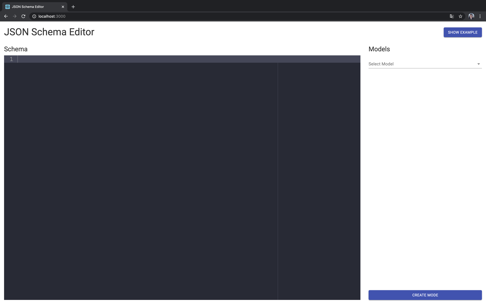</center>

Ao selecionando o `Select model` é possivel ver todos os Schemas pré definidos no editor. O `New model` é onde se deve criar os novos Schemas.

# <center>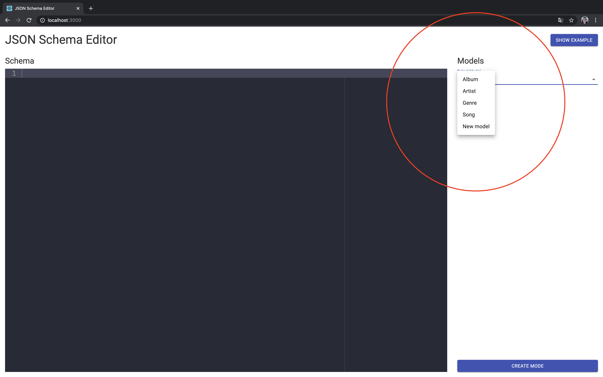</center>

Ao selecionar um dos Schemas existeste, o editor é atualizado com o conteudo desse modelo.

# <center>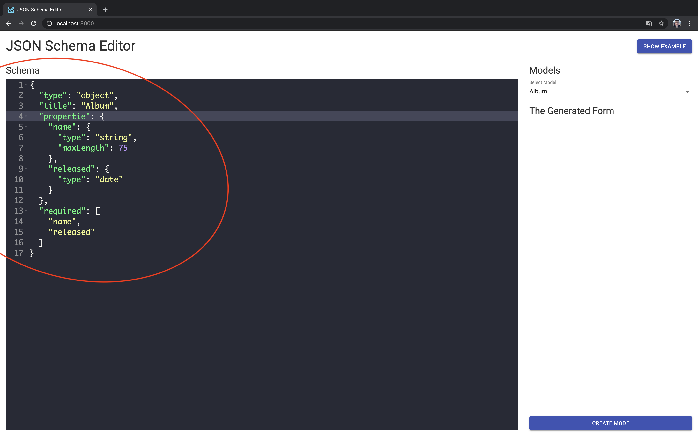</center>

Caso o usuário altero um modelo existete, ou crie um novo, é feito uma validação se o Schema é válido, caso não for, é exibido a mensagem ``SCHEMA INVALID```.

# <center>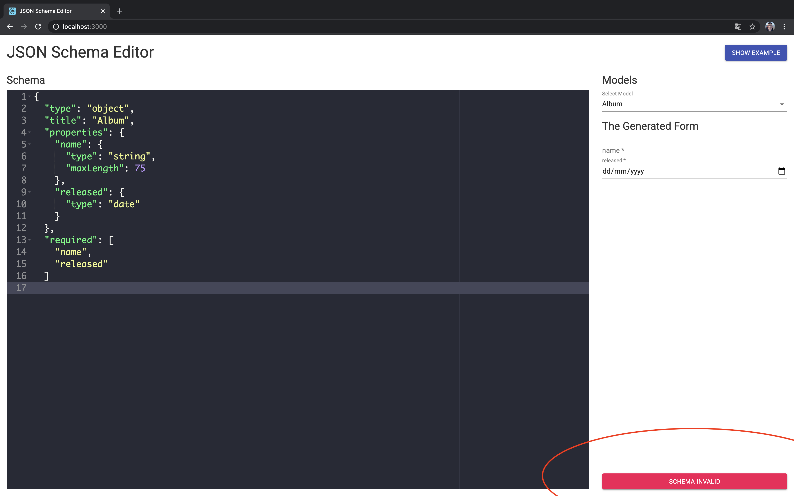</center>

Para auxiliar e facilitar a criação dos Schemas, foi adicionado um modal com um Schema de exemplo.

# <center>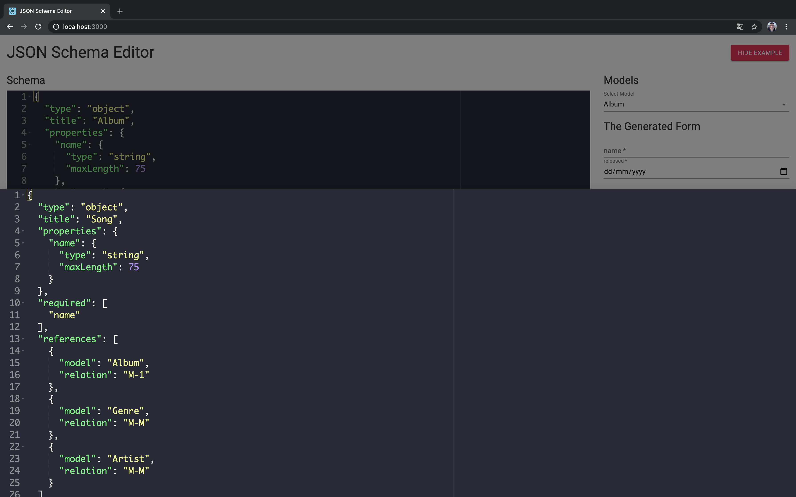</center>

Algumas verificação de propriedades obrigatórias são feitas antes da geração dos modelos.

# <center></center>

# <center>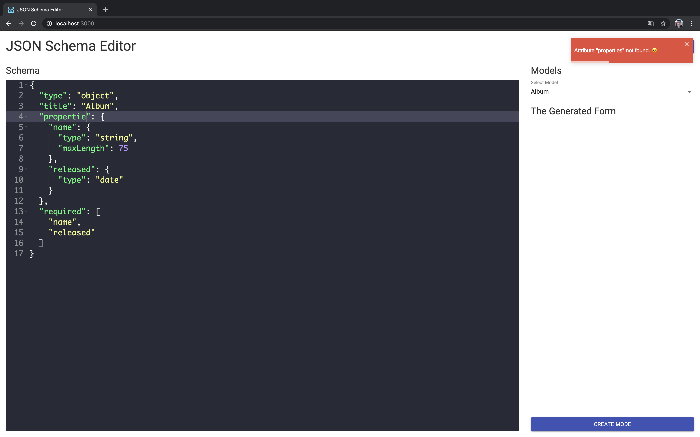</center>

## 2. Front

Por meio do front serão realizados as operações CRUD nos modelos. Tal operações disponíveis atráves de alguns icones da tabela.

# <center>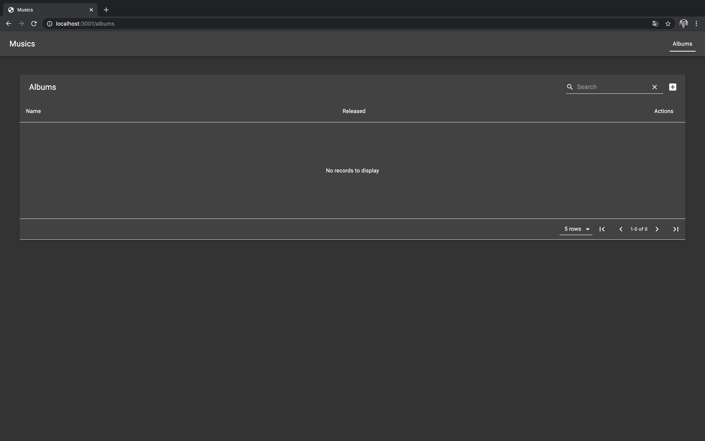</center>

Ao clicar no icone `+`, uma linha com os dados vazios é inserida na tabela, a partir daqui, o usuário deve completar as colunas.

# <center>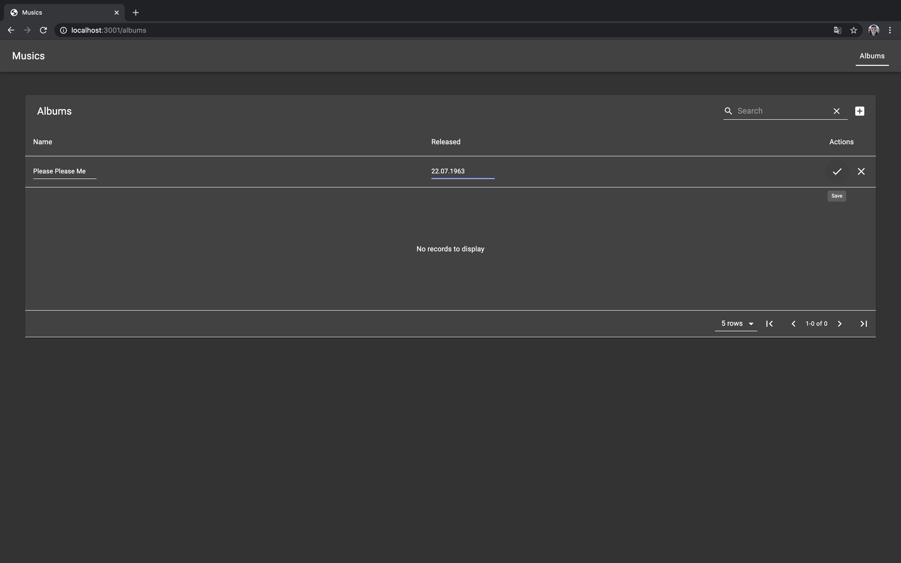</center>

Após o registro ser criado, aparecerão os icones para editar e deletar. Ao clicar no icone do lápis, é aberto uma linha igual ao do criar registro. O lixo representa a ação de deletar o registro.

# <center>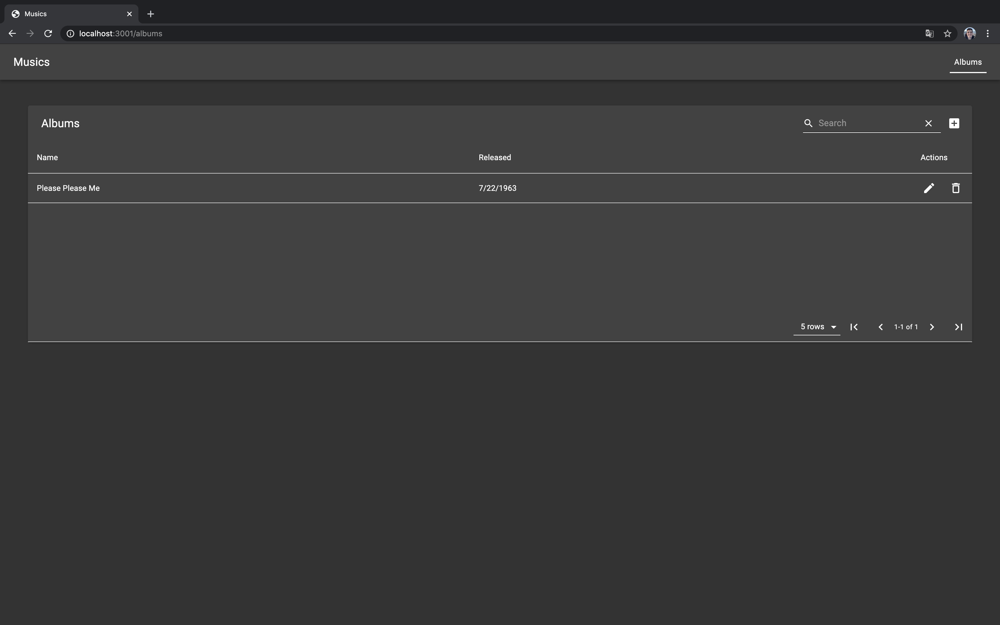</center>

Ao deletar, é solicitado a confirmação da intenção, ao confirmar, o registro é deletado.

# <center>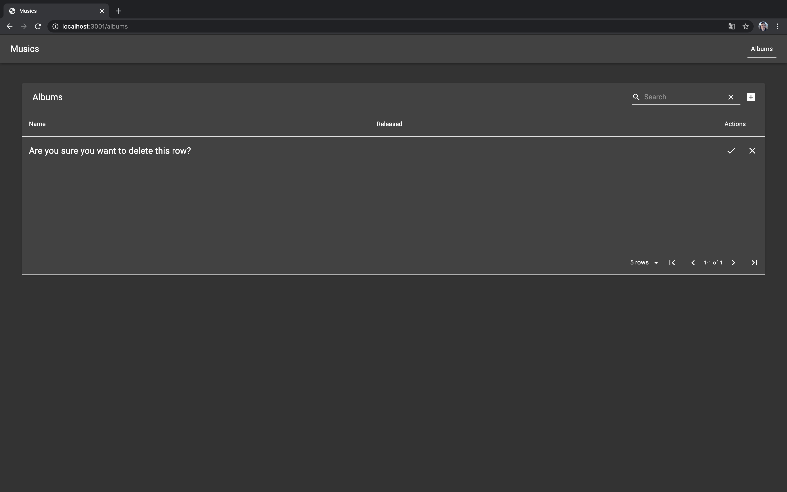</center>

Cada coluna pode possuir seu componente de input, Os disponíveis são: texto, número, calendário, select e checkbox.

# <center>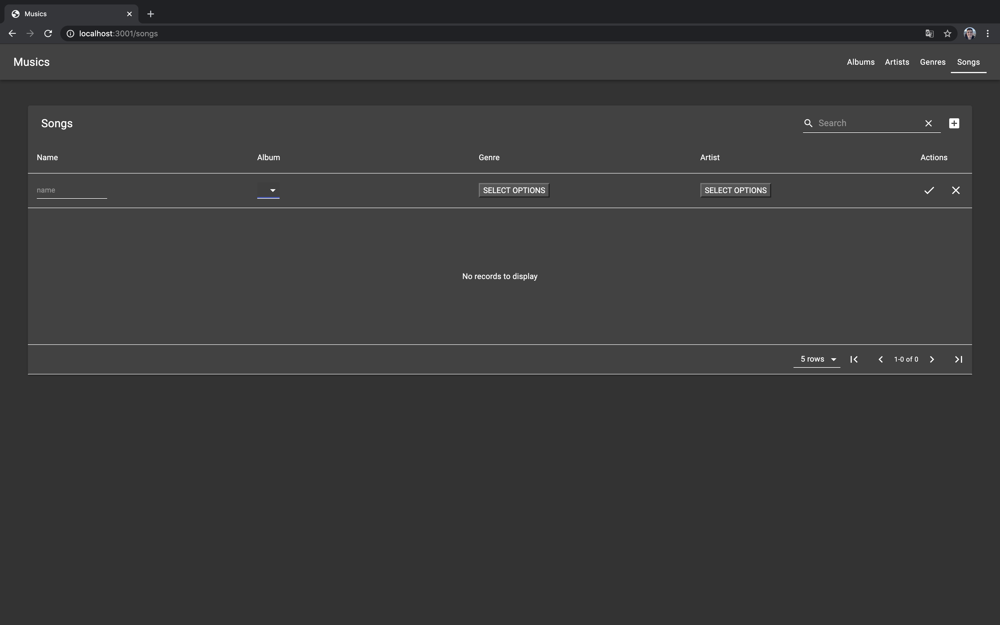</center>

O select é para a seleção de apenas um valor. Usado em relações M-1.

# <center>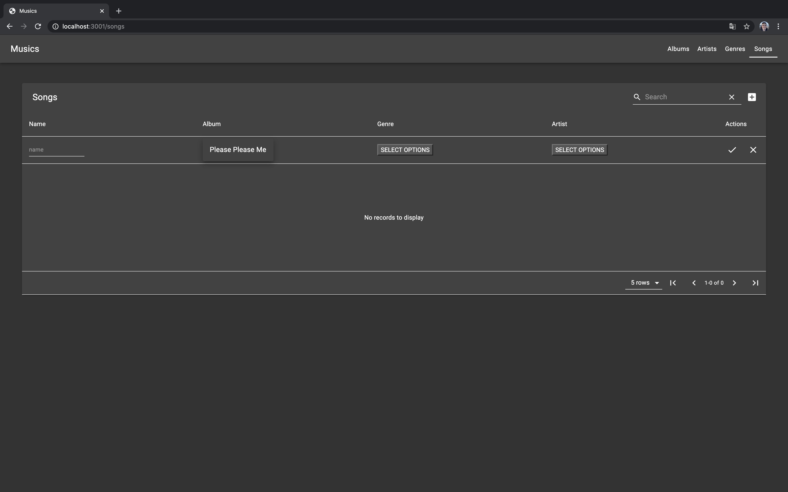</center>

O checkbox é usado para mutiplas seleções. Propriamente em relações M-M.

# <center>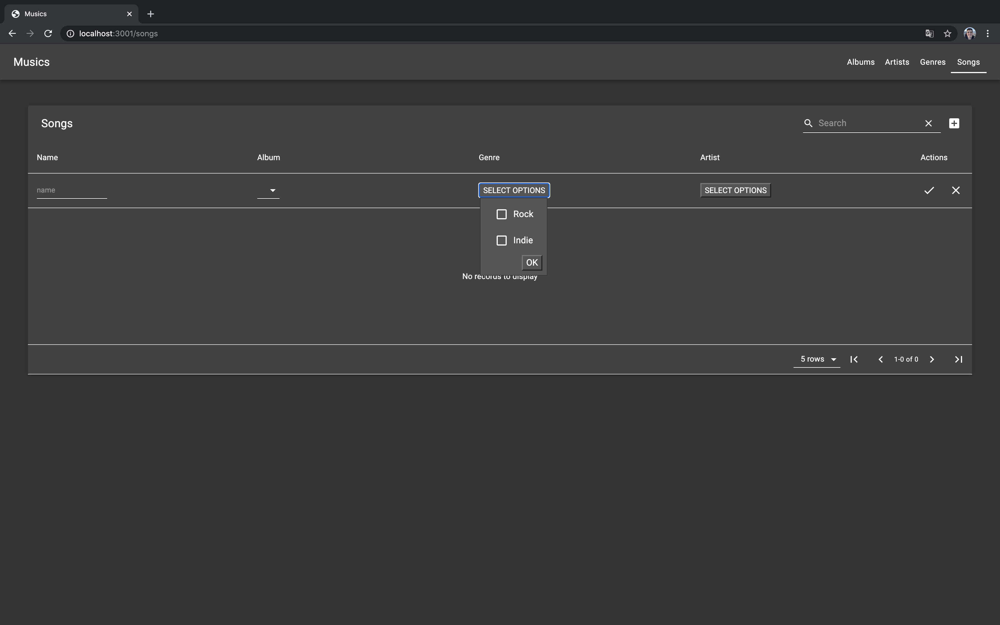</center>

O calendário é usado para selecionar as datas.

# <center>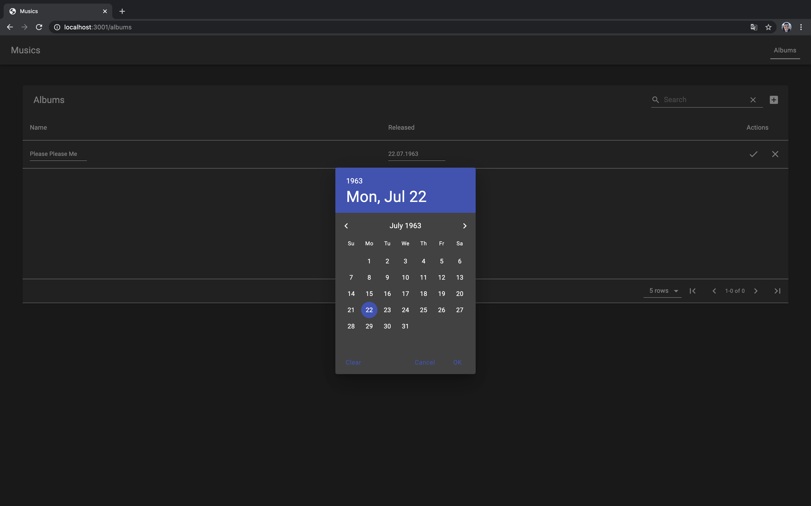</center>
